# Paxis RAG Pipeline - Architecture Diagrams

Detailed step-by-step diagrams for each phase of the Paxis retrieval-augmented generation pipeline.

---

## Phase 1: Document Ingestion & Processing

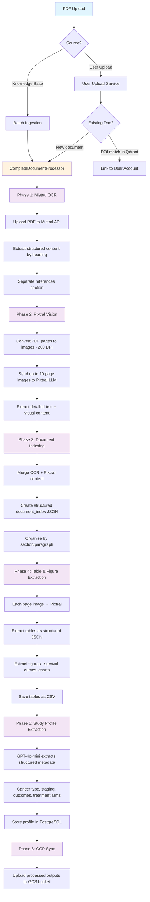

### Processing Outputs Table

| Output | Format | Description |
|--------|--------|-------------|
| Structured Content | JSON | OCR-extracted text organized by heading |
| Pixtral Content | Text | Vision-extracted detailed content |
| Document Index | JSON | Merged structured index (section → paragraphs) |
| Tables | JSON + CSV | Extracted tabular data with headers |
| Figures | JSON | Survival curves, charts, diagrams |
| Study Profile | JSON → PostgreSQL | Structured metadata (cancer type, outcomes, arms) |
| Summary Report | JSON | Processing statistics and file manifest |

---

## Phase 2: Chunking + Embedding + Database Upsert

### 2a. Chunking Strategy

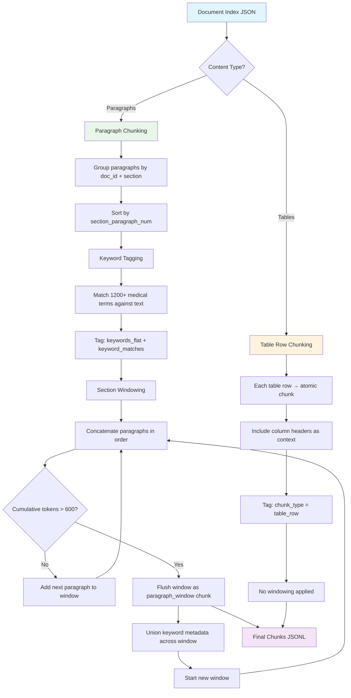

### Chunking Parameters

| Parameter | Value | Description |
|-----------|-------|-------------|
| Max tokens per chunk | 600 | Section window token limit |
| Tokenizer | tiktoken o200k_base | Token counting |
| Min paragraph length | 20 chars | Skip very short paragraphs |
| Keyword source | extractor_keywords.json | 1200+ medical terms |
| Keyword matching | Case-insensitive substring | Against chunk text |
| Keywords in embedding | No | Clean text only for embeddings |

### 2b. Embedding

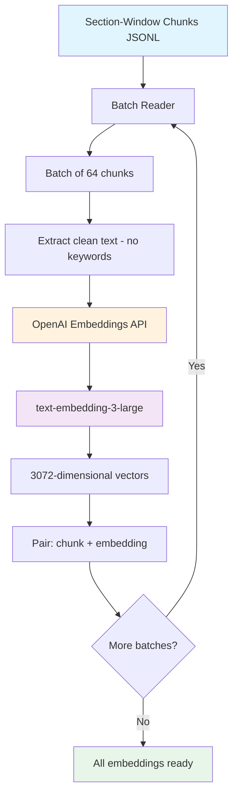

### Embedding Configuration

| Parameter | Value |
|-----------|-------|
| Model | text-embedding-3-large |
| Dimensions | 3072 |
| Batch size | 64 chunks per API call |
| Input | Clean text only (no keyword augmentation) |
| Point ID | UUID5 deterministic from chunk_id |

### 2c. Database Upsert

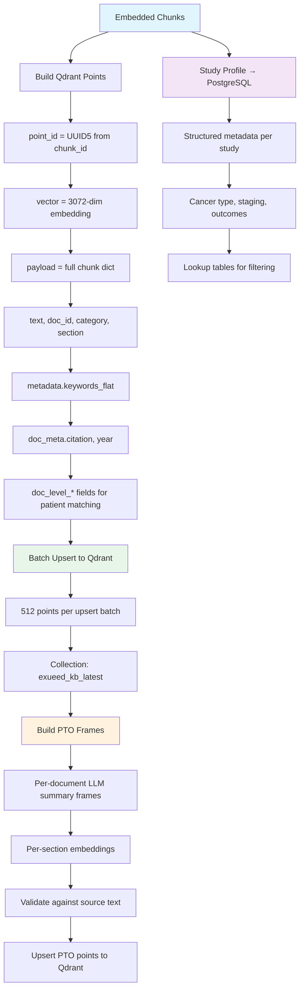

### Storage Architecture

| Store | Content | Purpose |
|-------|---------|---------|
| Qdrant (exueed_kb_latest) | Chunk vectors + full payload + doc_level_* metadata | Semantic search + patient matching |
| Qdrant (PTO frames) | Per-doc summary vectors | Document-level retrieval |
| PostgreSQL (display-study-details) | Study profiles | Structured filtering + eligibility criteria |
| PostgreSQL (study-profiles) | Normalized profiles + lookup tables | Faceted search |
| PostgreSQL (exueed_cache) | User data, uploads, saved cases | Application state |

---

## Phase 3: Query Processing + Retrieval + Answer Extraction

### 3a. Query Processing (Phases 0-3)

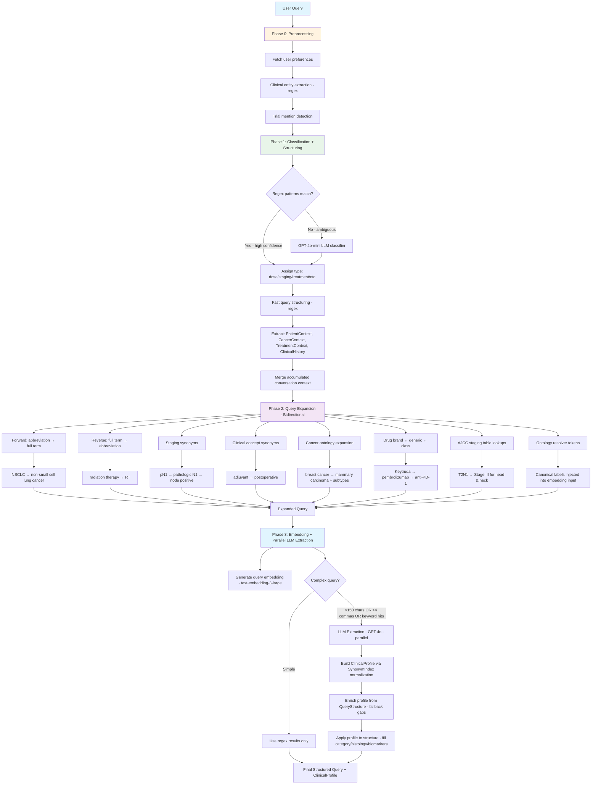

### Query Types

| Type | Example | Prompt Template |
|------|---------|-----------------|
| treatment_recommendation | "What is the standard treatment for..." | Recommended Treatment / Dose / Guideline Level |
| dose_question | "What dose for prostate SBRT?" | Prescribed Dose / Fractionation / Target Volume |
| indication_question | "When is adjuvant RT indicated?" | Indication / Patient Selection / Contraindications |
| trial_results | "What did RTOG 0617 show?" | Trial Design / Key Outcomes / Clinical Relevance |
| staging | "What stage is T3N1M0 lung?" | Stage Classification / Criteria / Prognosis |
| side_effects | "Toxicity of concurrent chemoRT?" | Acute/Late Effects / Grading / Management |
| comparison | "SBRT vs conventional fractionation?" | Head-to-head / Outcomes / Patient Selection |
| workup | "Workup for newly diagnosed NSCLC?" | Imaging / Labs / Pathology / Staging |
| general | Other queries | Evidence Summary / Key Findings |

### 3b. Retrieval (Phases 3.5-9)

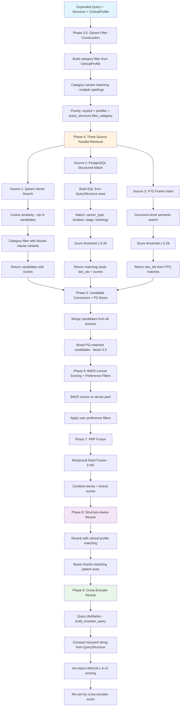

### 3c. Post-Retrieval Processing (Phases 10-13)

```mermaid
flowchart TD
    A[Cross-Encoder Reranked Results] --> P10[Phase 10: Score Boosting Pipeline]
    P10 --> P10a[Dose chunk boost - for dose queries]
    P10a --> P10b[Trial name boost - detected trial mentions]
    P10b --> P10c[Lane separation - trials vs guidelines/landmarks]
    P10c --> P10c1[Trial lane: up to 12 docs]
    P10c --> P10c2[Guideline lane: up to 5 docs - capped, not inflated]
    P10c1 --> P10d[Module-specific boost]
    P10c2 --> P10d
    P10d --> P10d1[general_knowledge / patient_specific / evidence_exploration]

    P10d1 --> P11[Phase 11: Dedup + Caps]
    P11 --> P11a[Max 2 chunks per doc]
    P11a --> P11b[Max 1 chunk per section]
    P11b --> P11c[Max 2 table rows per table]
    P11c --> P11d[Sort preference boost]

    P11d --> P12[Phase 12: Evidence Packs]
    P12 --> P12a[Build evidence packs with neighbor windows]
    P12a --> P12b[Include: title, citation, year, category]

    P12b --> P13[Phase 13: NCCN Gap Detection]
    P13 --> P13a[Detect missing guideline coverage]

    P13a --> POST[Post-Retrieval Processing]
    POST --> POST1[Patient-match scoring per source - 0-100]
    POST1 --> POST2[Cancer-type post-filter - remove wrong-cancer studies]
    POST2 --> POST3[Patient eligibility hard filter + boost]
    POST3 --> POST3a[LLM-based per-study eligibility - 8 axes]
    POST3a --> POST3b[Hard-drop: cancer_type, disease_status, surgical_candidacy]
    POST3b --> POST3c[Hard-drop: study_exclusions_violated]
    POST3c --> POST4[Context document boost - conversation continuity]

    POST4 --> FINAL[Final Evidence Bundle]

    style A fill:#e1f5fe
    style P10 fill:#fff3e0
    style P11 fill:#f3e5f5
    style POST fill:#e8f5e9
    style FINAL fill:#e1f5fe
```

### Retrieval Parameters

| Parameter | Value | Description |
|-----------|-------|-------------|
| Qdrant candidates | Top 100 | Initial vector search pool |
| PostgreSQL threshold | 0.35 | Minimum structured match score |
| PTO threshold | 0.28 | Minimum PTO frame score |
| PG boost factor | 0.3 | Additive boost for PG-matched candidates |
| RRF k | 60 | Reciprocal Rank Fusion constant |
| Rerank pool | Top 50 | Candidates sent to structure-aware rerank |
| Cross-encoder | ms-marco-MiniLM-L-6-v2 | Neural reranker (distilled query) |
| Trial lane cap | 12 docs | Maximum trial documents in lane |
| Guideline lane cap | 5 docs | Maximum guideline/landmark documents |
| Max per doc | 2 chunks | Dedup cap per document |
| Max per section | 1 chunk | Dedup cap per section |

### Patient-Match Scoring (per source)

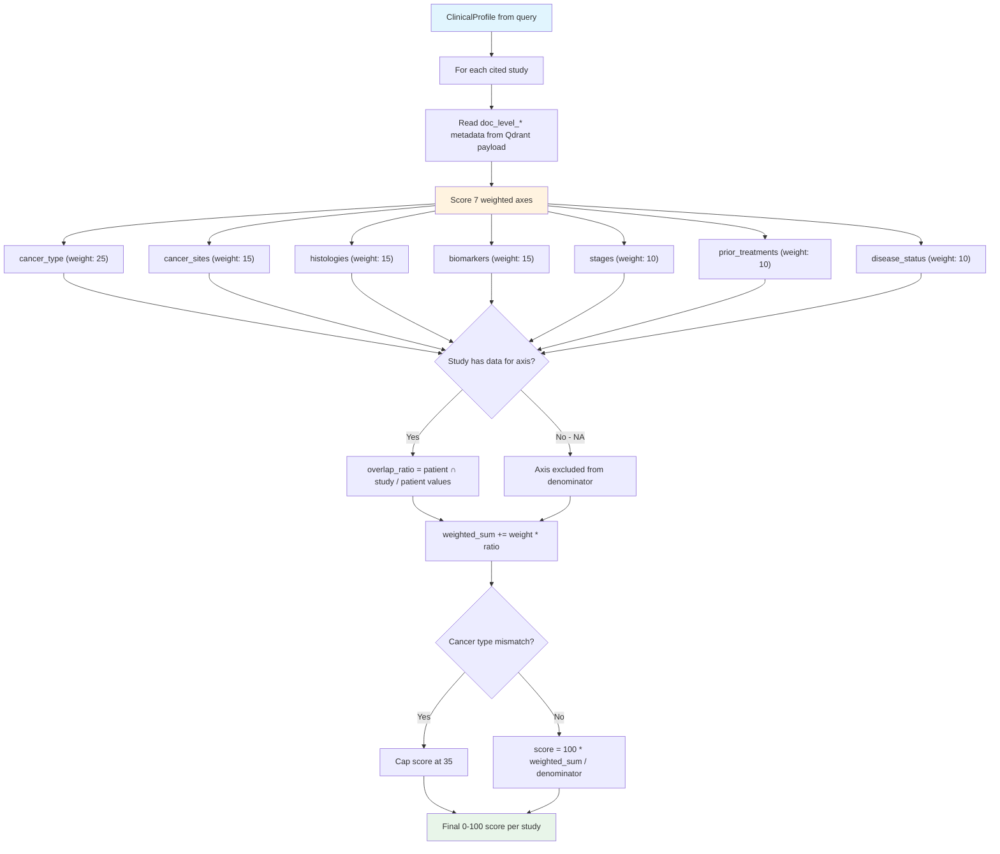

### Patient Eligibility Hard Filter

| Axis | Hard Drop? | Description |
|------|-----------|-------------|
| cancer_type | Yes | Wrong cancer → remove study |
| histology | No | Mismatch penalizes score only |
| stage | No | Mismatch penalizes score only |
| prior_therapies | No | Mismatch penalizes score only |
| biomarkers | No | Mismatch penalizes score only |
| disease_status | Yes | Wrong trajectory → remove study |
| surgical_candidacy | Yes | Incompatible surgical status → remove |
| study_exclusions_violated | Yes (inverted) | Patient violates exclusion → remove |

---

## Phase 4: Generation

```mermaid
flowchart TD
    A[Assembled Prompt + Evidence] --> B[GPT-4o Generation]
    B --> B1[Query-type-specific system prompt - 9 templates]
    B1 --> B2[Structured evidence as user context]
    B2 --> B3[Staging context from normalizer]
    B3 --> B4[Patient eligibility verification]
    B4 --> B5[Conversation history - up to 10 entries]
    B5 --> B6[Generate comprehensive answer]

    B6 --> C[Post-Generation Validation]
    C --> C1[Numerical Validation]
    C1 --> C1a[Extract all numbers from answer]
    C1a --> C1b[Cross-check against source evidence]
    C1b --> C1c{Number found in sources?}
    C1c -->|Yes| C1d[Keep number]
    C1c -->|No| C1e[Strip unvalidated number]

    C1d --> C2[Statistical Enrichment]
    C1e --> C2
    C2 --> C2a[Add confidence intervals from evidence]
    C2a --> C2b[Add p-values from evidence]
    C2b --> C2c[Add hazard ratios from evidence]

    C2c --> D[Structured Output Parsing]
    D --> D1[Parse into layered structure]
    D1 --> D2[brief_answer: 1-2 sentence summary]
    D2 --> D3[structured_details: key-value pairs by section]
    D3 --> D4[explanation: full narrative with citations]

    D4 --> E[Follow-Up Generation]
    E --> E1[Generate 3-5 contextual follow-up questions]
    E1 --> E2[Based on query type + evidence gaps]

    E2 --> F[Citation Assembly]
    F --> F1[Map cited studies to full references]
    F1 --> F2[Fetch citation counts - Semantic Scholar API]
    F2 --> F3[Include DOI links where available]

    F3 --> G[Final Response]
    G --> G1[answer: synthesized text]
    G1 --> G2[sources: cited studies with metadata + patient_match_score]
    G2 --> G3[follow_ups: suggested next questions]
    G3 --> G4[query_type: classified type]
    G4 --> G5[structured_output: layered response object]
    G5 --> G6[conversation_context: for session continuity]
    G6 --> G7[module_name: routing classification]

    style A fill:#e1f5fe
    style B fill:#fff3e0
    style C fill:#f3e5f5
    style D fill:#e8f5e9
    style F fill:#fff3e0
    style G fill:#e1f5fe
```

### Generation Configuration

| Parameter | Value | Description |
|-----------|-------|-------------|
| Model | GPT-4o | Primary generation model |
| Temperature | 0.1 | Low for factual accuracy |
| Prompt templates | 9 types | Query-type-specific formatting |
| Numerical validation | Post-hoc | Strip numbers not in evidence |
| Citation format | Author (Year) | Inline with full reference list |
| Follow-ups | 3-5 | Contextual suggestions |

### Response Structure

| Field | Type | Description |
|-------|------|-------------|
| answer | string | Full synthesized narrative |
| brief_answer | string | 1-2 sentence summary |
| structured_details | object | Key-value pairs by section header |
| sources | array | Cited studies with title, citation, year, doc_id, patient_match_score |
| follow_ups | array | Suggested follow-up questions |
| query_type | string | Classified query type |
| module_name | string | Module classification (general_knowledge/patient_specific/evidence_exploration) |
| metadata | object | Timings, retrieval stats, model used |
| conversation_context | object | Doc IDs + structure for session continuity |

---

## Phase 5: PDF Report Generation

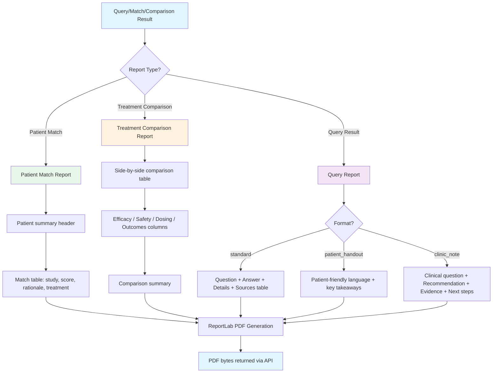

### Report Endpoints

| Endpoint | Method | Description |
|----------|--------|-------------|
| `/api/report/patient-match` | POST | PDF from patient matching result |
| `/api/report/treatment-comparison` | POST | PDF from treatment comparison |
| `/api/report/query` | POST | PDF from query result (3 formats) |

---

## End-to-End Pipeline Overview

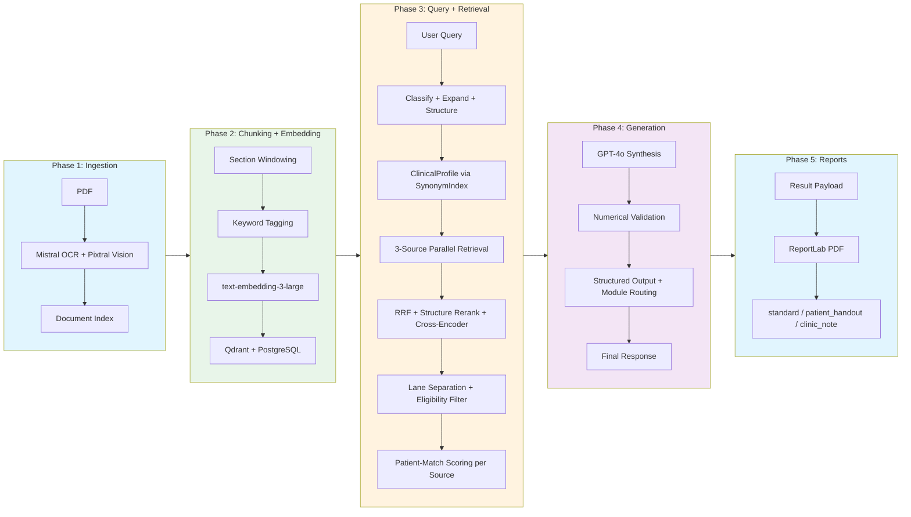
